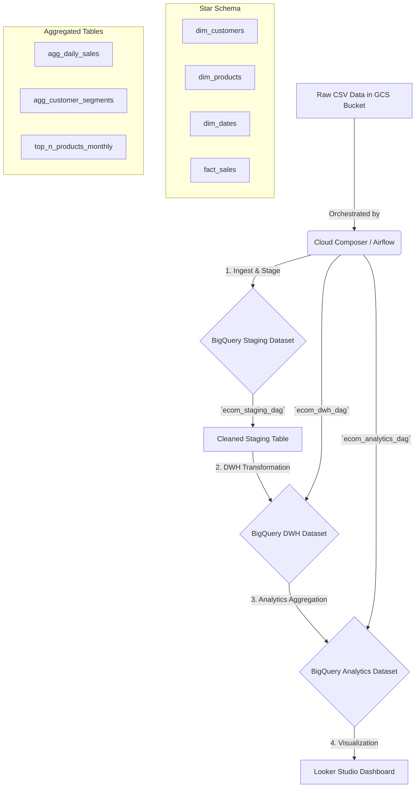

#  End-to-End E-commerce Analytics Pipeline on GCP

A scalable, cloud-native data pipeline that automates the ingestion, transformation, and analysis of e-commerce data, culminating in an interactive business intelligence dashboard.

---

##  Final Dashboard

*A preview of the interactive dashboard built with Looker Studio, providing key insights into sales performance and customer segmentation.*

---

##  Key Features

*   ** Cloud-Native Architecture:** Built entirely on Google Cloud Platform for scalability and reliability.
*   ** Automated ETL Orchestration:** Uses Apache Airflow to manage the full workflow with scheduling, dependencies, and retries.
*   ** Advanced Customer Segmentation:** Implements **RFM (Recency, Frequency, Monetary) analysis** with complex SQL to categorize customers into segments like 'Champions', 'At Risk', and 'Loyal'.
*   ** Dimensional Data Modeling:** Transforms raw data into a query-optimized Star Schema, perfect for analytical workloads.
*   ** Interactive Visualization:** Connects the clean, aggregated data to Looker Studio for insightful business reporting.

---

##  Architecture Diagram

The pipeline follows a modern ETL approach, moving data from a raw landing zone to a structured data warehouse and finally to aggregated analytics tables for fast dashboarding.

Follow these steps to replicate the project environment.
Prerequisites

    A Google Cloud Platform project with billing enabled.

    A running Cloud Composer 2 environment.

    Enabled APIs: Cloud Composer, BigQuery, Cloud Storage.

    gcloud CLI and gsutil tools installed (or use Cloud Shell).

1. Create GCP Resources

    Create GCS Bucket for Raw Data:
    code Bash

    
gsutil mb -p YOUR_PROJECT_ID gs://your-raw-data-bucket-name

  

Create BigQuery Datasets:
code Bash

        
    bq mk --location=US ecommerce_staging
    bq mk --location=US ecommerce_dwh
    bq mk --location=US ecommerce_analytics

      

2. Configure & Deploy

    Configure: Update the config/gcp_config.json file with your project and bucket details.

    Upload Data: Download the Online Retail Dataset and upload it to your GCS bucket.
    code Bash

    
gsutil cp data/data.csv gs://your-raw-data-bucket-name/raw_sales/sample_e_commerce_data.csv

  

Upload Code to Composer: Sync the project folders to your environment's DAGs bucket.
code Bash

        
    # Find your DAGs bucket URI in the Composer environment details page
    gsutil -m rsync -r ./dags gs://<YOUR_COMPOSER_DAGS_BUCKET_URI>
    gsutil -m rsync -r ./sql gs://<YOUR_COMPOSER_DAGS_BUCKET_URI>/sql
    gsutil -m rsync -r ./config gs://<YOUR_COMPOSER_DAGS_BUCKET_URI>/config

      

3. Run and Visualize

    Open the Airflow UI from the Cloud Composer page.

    Un-pause the four ecom_* DAGs.

    Trigger the pipeline by running the ecom_ingestion_dag.

    Once the pipeline completes, connect Looker Studio to the ecommerce_analytics BigQuery dataset and build your dashboards!
